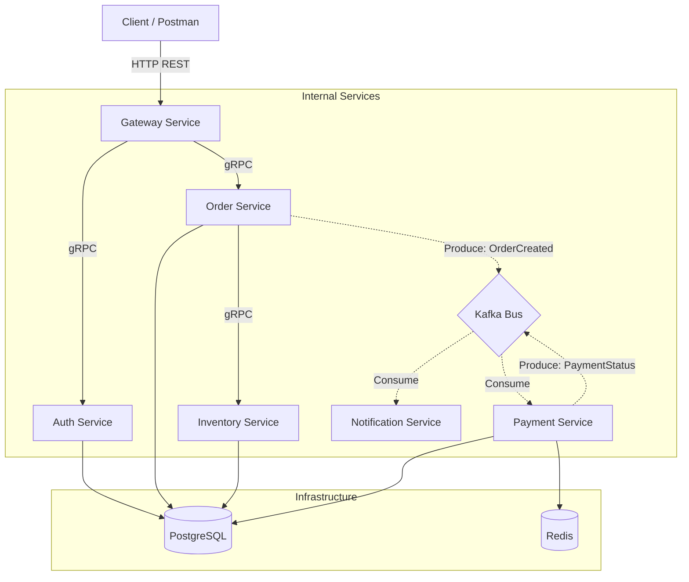

# 💳 Payment Microservices System (2026)

Высокопроизводительная распределенная система обработки заказов и платежей, построенная на микросервисной архитектуре с использованием **Go 1.26.1**, **gRPC**, **Kafka 4.2** и современных паттернов проектирования.

Проект демонстрирует реализацию отказоустойчивой системы с гарантированной доставкой сообщений, распределенными транзакциями и сквозным мониторингом.

---

## 🏗 Архитектура

Система состоит из нескольких независимых сервисов, взаимодействующих через синхронные (gRPC) и асинхронные (Kafka) каналы связи.



---

## 🚀 Основные возможности и Паттерны

1.  **Transactional Outbox**: Гарантирует атомарность сохранения данных в БД и отправки события в Kafka. Даже если брокер временно недоступен, события будут доставлены после восстановления связи.
2.  **Circuit Breaker**: Защита сервисов от каскадных сбоев при перегрузке или падении зависимых компонентов (реализовано в `pkg/grpcutil`).
3.  **Event-Driven Design**: Асинхронное взаимодействие для процессов оплаты и уведомлений, что повышает отзывчивость системы.
4.  **Idempotency**: Обработка платежей и заказов защищена от повторных запросов с помощью Redis.
5.  **Clean Architecture**: Четкое разделение на слои (handler, service, repository, worker) внутри каждого микросервиса.

---

## 🛠 Технологический стек

-   **Runtime**: [Go 1.26.1](https://go.dev/)
-   **Communication**: [gRPC](https://grpc.io/) & [Protobuf](https://developers.google.com/protocol-buffers)
-   **Schema Management**: [Buf CLI](https://buf.build/)
-   **Message Broker**: [Apache Kafka 4.2](https://kafka.apache.org/) (Native KRaft mode)
-   **Databases**: [PostgreSQL 17](https://www.postgresql.org/), [Redis 7](https://redis.io/)
-   **Containerization**: [Docker](https://www.docker.com/) & [Docker Compose](https://docs.docker.com/compose/)

---

## 📂 Структура проекта

```text
.
├── api/proto/          # Описания gRPC сервисов и Protobuf файлы
├── pkg/                # Общие библиотеки (logger, config, grpcutil, kafka, postgres)
├── services/           # Реализация микросервисов
│   ├── auth/           # Аутентификация и JWT токены
│   ├── gateway/        # API Gateway (HTTP -> gRPC proxy)
│   ├── inventory/      # Управление складскими запасами
│   ├── notification/   # Сервис уведомлений (Kafka consumer)
│   ├── order/          # Управление заказами и Transactional Outbox
│   └── payment/        # Обработка платежей (Redis + Kafka)
├── scripts/            # Вспомогательные скрипты и SQL инициализация
├── docker-compose.yml  # Оркестрация локального окружения
└── go.work             # Go Workspaces для мульти-репозиторной структуры
```

---

## 🏁 Быстрый запуск

### Предварительные требования
- Docker & Docker Compose
- Go 1.26+ (для локальной разработки)

### Запуск всей инфраструктуры
Развертывание всех сервисов и баз данных одной командой:

```bash
docker-compose up --build -d
```

Система будет доступна по адресу `http://localhost:8080`.

---

## 📡 API Documentation (Gateway)

### 1. Аутентификация
Получение токена доступа.
**POST** `/v1/auth/login`
```json
{
  "user_id": "550e8400-e29b-41d4-a716-446655440000",
  "email": "dev@example.com"
}
```

### 2. Создание заказа
**POST** `/v1/orders`
**Header**: `Authorization: Bearer <token>`
```json
{
  "user_id": "550e8400-e29b-41d4-a716-446655440000",
  "items": [
    { "product_id": "prod_123", "quantity": 2, "price": 499.99 }
  ]
}
```

---

## ⚙️ Разработка

### Генерация Protobuf кода
Мы используем **Buf** для управления proto-файлами. Для генерации кода выполните:

```bash
cd api/proto
buf generate
```
*Или через Docker:*
```bash
docker run --rm -v "$(pwd):/workspace" -w /workspace/api/proto bufbuild/buf:1.50.0 generate
```

### Переменные окружения
Основные настройки хранятся в `docker-compose.yml` и включают:
- `POSTGRES_DSN`: Строка подключения к БД.
- `KAFKA_BROKERS`: Список адресов брокеров Kafka.
- `JWT_SECRET`: Ключ для подписи токенов.
- `LOG_LEVEL`: Уровень логирования (debug, info, error).

---

## 🛡 Безопасность и Мониторинг
- **Health Checks**: Каждый сервис в Docker Compose имеет настроенные проверки состояния (healthcheck).
- **Graceful Shutdown**: Все сервисы корректно завершают работу, закрывая соединения с БД и Kafka.
- **Resource Limits**: В Docker настроены лимиты CPU и RAM для предотвращения деградации системы.

---

## 📝 Лицензия
Данный проект распространяется под лицензией MIT. Подробности в файле [LICENSE](LICENSE).
